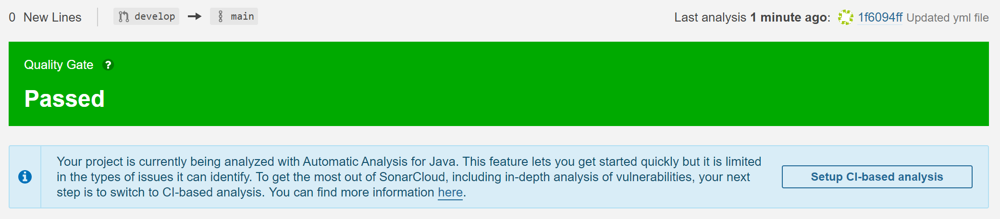

# Continuous Integration Final Project
## By: Cesar Illanes

The project already came with a pipeline called maven-build.yml that included:

```
# This workflow will build a Java project with Maven, and cache/restore any dependencies to improve the workflow execution time
# For more information see: https://help.github.com/actions/language-and-framework-guides/building-and-testing-java-with-maven

name: Java CI with Maven

on:
  push:
    branches: [ main ]
  pull_request:
    branches: [ main ]

jobs:
  build:

    runs-on: ubuntu-latest

    steps:
      - uses: actions/checkout@v2
      - name: Set up JDK 11
        uses: actions/setup-java@v2
        with:
          java-version: '11'
          distribution: 'adopt'
          cache: maven
      - name: Build with Maven Wrapper
        run: ./mvnw -B package
```

I changed the file name to main-workflow.yml and its content to meet the requirements.
* Added the ```./mvnw run``` command\
* Signed in into SonalCloud, create an organization and then added this repository as a project. It automatically as you can see in the next screenshots.


  * As you can see in the first picture, it recommends to change to the CI-based analysis, so that was my next step
  * I set-up the SONAT_TOKEN secret in GitHub Actions, added properties in pom.xml, added some lines to the workflow and disabled the automatic analysis.